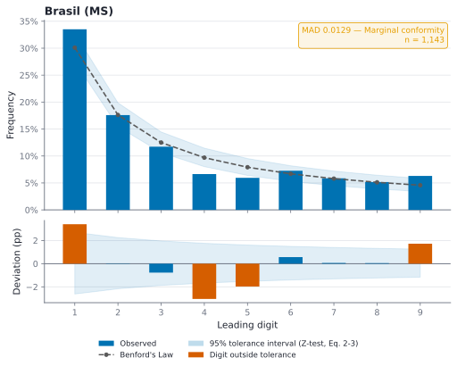
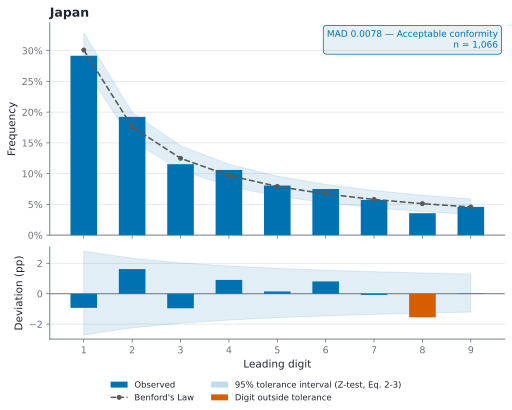
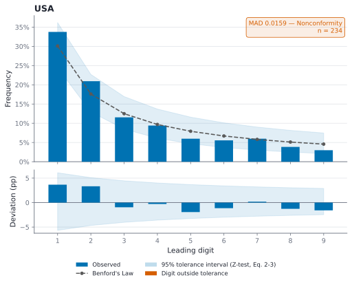
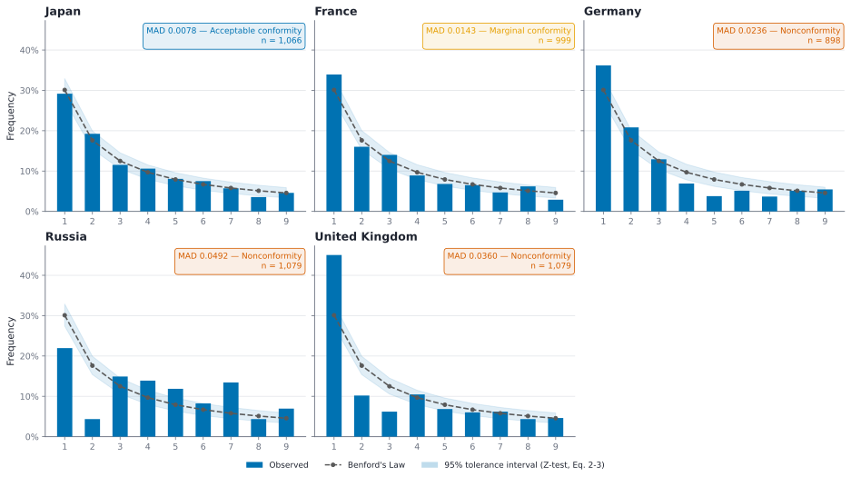
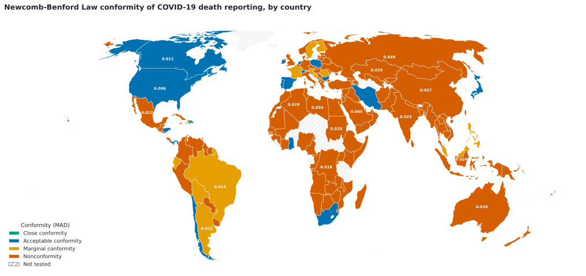
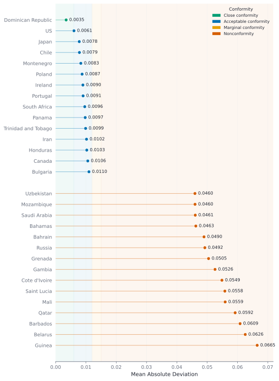

<p align="center">
    <picture>
      <source media="(prefers-color-scheme: dark)" srcset="https://www.gov.br/cnpq/pt-br/canais_atendimento/identidade-visual/cnpq_mcti_gov_horizontal_fundo_escuro.png">
      <source media="(prefers-color-scheme: light)" srcset="https://www.gov.br/cnpq/pt-br/canais_atendimento/identidade-visual/cnpq_mcti_horizontal_fundo_transparente.png">
      
    </picture>
</p>

<div align="center">

# Lutero

**Multifactorial Analysis of SARS-CoV-2 Mortality Data Consistency in Major World Health Organization Countries: A Newcomb-Benford Law Approach**

<p>
  
  
  
</p>

<p>
  <a href="#what-is-this">What is this</a> •
  <a href="#method">Method</a> •
  <a href="#data-sources">Data sources</a> •
  <a href="#results">Results</a> •
  <a href="#getting-started">Getting started</a> •
  <a href="#project-structure">Project structure</a>
</p>

</div>

---

## What is this

The COVID-19 pandemic produced an enormous volume of self-reported mortality data, collected under wildly different methodologies, incentives, and political pressures across countries. This project uses the **Newcomb-Benford Law (NBL)** — a well-known result in digit analysis, widely used in forensic accounting and fraud detection — as a lens on that data: it checks whether the leading digit of daily death-count changes follows the logarithmic distribution NBL predicts for naturally occurring numbers, and flags countries/sources whose reporting deviates from it.

This isn't proof of fraud on its own — reporting delays, small sample sizes, and legitimate structural factors can all produce deviations too — but it's a cheap, data-only signal for *where to look closer*.

The full academic writeup is in [`Article.pdf`](Article.pdf) (pt-BR, not yet published).

## Method

NBL states that the probability of a digit `d` (1–9) being the leading digit of a naturally occurring number follows:

$$P(d) = \log_{10}\left(1 + \frac{1}{d}\right)$$

| Leading digit | 1 | 2 | 3 | 4 | 5 | 6 | 7 | 8 | 9 |
|---|---|---|---|---|---|---|---|---|---|
| Expected frequency | 30.1% | 17.6% | 12.5% | 9.7% | 7.9% | 6.7% | 5.8% | 5.1% | 4.6% |

For each country/source, the leading digit is extracted from every day-over-day change in reported deaths, and the observed distribution is compared against the expected one using two complementary tools:

- **Mean Absolute Deviation (MAD)** — the average absolute gap between observed and expected frequencies across all nine digits, classified using Nigrini's standard thresholds (Drake & Nigrini, 2000):

  | MAD | Conformity | Color |
  |---|---|---|
  | < 0.006 | Close | 🟩 |
  | < 0.012 | Acceptable | 🟦 |
  | < 0.015 | Marginal | 🟧 |
  | ≥ 0.015 | Nonconformity | 🟥 |

  These four categories, and their colors, are used consistently everywhere in this README — on every country's chart, in the country-ranking chart, and on the world map — so the same color always means the same thing.

- **95% tolerance interval** — a per-digit Z-test interval (Z = 1.96, with the continuity correction from the paper's Eq. 2-3) around the expected frequency. Every country chart shows two views of it: as a shaded band around the expected curve, and again as a band re-centered on zero in a **deviation panel** underneath, where each digit's observed-minus-expected gap is plotted directly as a signed bar — so a digit poking outside the band is flagged by position, not just by color.

Charts are colorblind-safe (Okabe–Ito palette) and rendered as vector SVG, so they stay crisp at any zoom.

## Data sources

| Source | Scope | Records | Period |
|---|---|---|---|
| [JHU CSSE COVID-19](https://github.com/CSSEGISandData/COVID-19) | 195 countries, daily cumulative deaths | varies by country | 2020–2023 |
| Brazil — [Consortium of Press Vehicles (CVI)](https://especiais.g1.globo.com/bemestar/coronavirus/dados/) | Brazil, daily deaths | 1,043 days | 2020–2023 |
| Brazil — [Ministério da Saúde](https://covid.saude.gov.br/) | Brazil, daily deaths (national total) | 1,143 days | 2020–2024 |
| [CDC COVID Data Tracker](https://covid.cdc.gov/covid-data-tracker) | United States, weekly deaths | 234 weeks | 2020–2024 |

## Results

### Brazil: two sources, two different pictures

Brazil is reported by two independent sources with different collection methodologies — a useful natural experiment for this kind of analysis.

<table>
<tr>
<td width="50%">

**CVI (press consortium)** — MAD 0.0170, **Nonconformity**. Digit 1 is over-represented (33.3% vs. 30.1% expected); the deviation panel shows digit 2 as the other main outlier.

</td>
<td width="50%">

**Ministério da Saúde** — MAD 0.0129, **Marginal conformity**. Noticeably closer to the expected curve than the press-consortium figures for the same period.

</td>
</tr>
<tr>
<td></td>
<td></td>
</tr>
</table>

### Japan: the closest fit in this study



With a MAD of 0.0078 (Acceptable conformity) on 1,066 days of data, Japan's daily death-count reporting tracks the expected curve more closely than any other country tested with a comparably large sample. Only digit 8 falls outside the tolerance interval.

### United States (CDC weekly data)



MAD 0.0159 (Nonconformity) on 234 weekly observations. Worth noting: this uses the CDC's *weekly* death counts, a much smaller and coarser-grained sample than the daily series used for other countries — small samples are inherently more sensitive to outliers, which the wide tolerance interval above reflects. (The JHU daily-cumulative series for the US, by contrast, scores a MAD of 0.0061 — a reminder that conformity can depend as much on reporting cadence as on data quality.)

### UN Security Council permanent members



Of these four, France shows the closest fit (MAD 0.0143, Marginal), while Russia diverges the most (MAD 0.0492, Nonconformity) — chiefly from an over-represented digit 1 and an under-represented digit 2.

### Global picture: 146 countries

Every JHU-tracked country with enough day-to-day variation to run the test (146 of 195) was scored. The map answers *where*; the ranking chart below it answers *how much*, precisely — both use the same four conformity colors as every chart above.



- **Global mean MAD:** 0.026 · **median:** 0.024
- Only **1** country reaches "Close" conformity, **18** are "Acceptable," **14** are "Marginal," and **113** fall into "Nonconformity" — a reminder that strict NBL conformity is a high bar, and most real-world reporting pipelines (imperfect but not necessarily fraudulent) don't clear it.

**Most and least conforming (top/bottom 15 of 146):**



## Getting started

```bash
pip install -r requirements.txt
```

```bash
# One country (JHU dataset)
python main.py --country Japan

# Every JHU country (also writes results/mad.txt and the ranking chart)
python main.py --all

# A specific dataset
python main.py --cvi   # Brazil, press consortium
python main.py --bms   # Brazil, Ministério da Saúde
python main.py --usa   # United States, CDC weekly deaths

# Side-by-side comparison grid for a handful of countries
python main.py --specific-countries Japan France Germany Russia "United Kingdom"

# World choropleth (needs results/mad.txt from `--all`)
python map.py
```

All charts are written to `results/` as SVG (gitignored — regenerate them locally; pass `fmt="png"` to `save_figure`/`map.py --fmt png` for a raster copy). The curated set embedded above lives in [`assets/`](assets/).

## Project structure

```
main.py              CLI entry point
map.py                World choropleth map (Equal Earth projection)
config.py             Dataset path configuration
func/
  benford.py           Newcomb-Benford digit-frequency math (numpy)
  tester.py             MAD, tolerance bounds, conformity classification
  data_loader.py         Pandas CSV loaders, one per raw dataset shape
  data_manager.py         Per-dataset death-variation extraction
  plotter.py               Chart rendering: distribution + deviation panels,
                            comparison grid, country ranking
  style.py                  Shared matplotlib theme (Okabe-Ito palette)
data/                 Raw datasets (JHU, Brazil CVI, Brazil MS, USA/CDC)
world_map/            Natural Earth 1:110m country shapefile
assets/               Curated result images used in this README
```

## Limitations

- Sample sizes vary widely by country (a few dozen to several thousand days), and NBL's tolerance bounds widen accordingly — a "Nonconformity" verdict on a small sample carries much less weight than the same verdict on a large one.
- Reporting-cadence differences (daily vs. weekly aggregation) measurably affect conformity, as shown by the two USA results above — cross-country comparisons should account for this.
- NBL deviation is a *signal*, not proof of manipulation; legitimate factors (population size, outbreak phase, revision policies) can also produce it.

## Authors

- **Bruno Bezerra Trigueiro** ([@koobzaar](https://github.com/koobzaar)) — [Lattes](http://lattes.cnpq.br/2341132684122094) · [LinkedIn](https://www.linkedin.com/in/brunotrigueiro/). Faculdade de Tecnologia de São Paulo (Fatec-SP), Análise e Desenvolvimento de Sistemas.
- **Orientador:** José Augusto Theodosio Pazetti — [Lattes](http://lattes.cnpq.br/8445469805205594). Doutor em Ciências da Saúde, Universidade Federal de São Paulo.
- **Coorientador:** Fernando Gonzales Tavares (in memoriam).

## License

Lutero © 2024 by Bruno Bezerra Trigueiro is licensed under [CC BY-NC 4.0](https://creativecommons.org/licenses/by-nc/4.0/).
